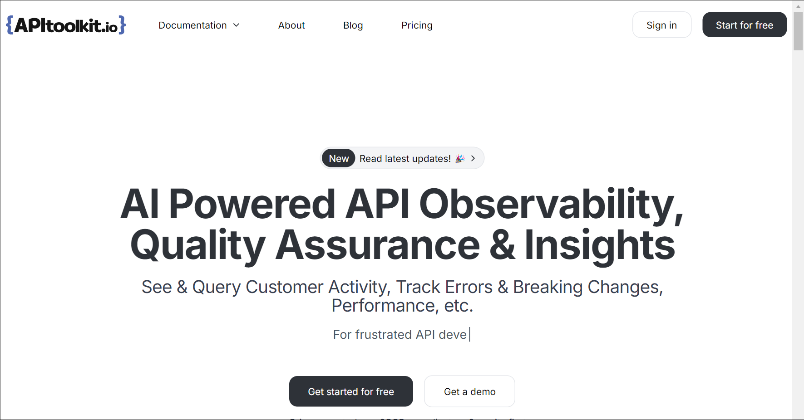
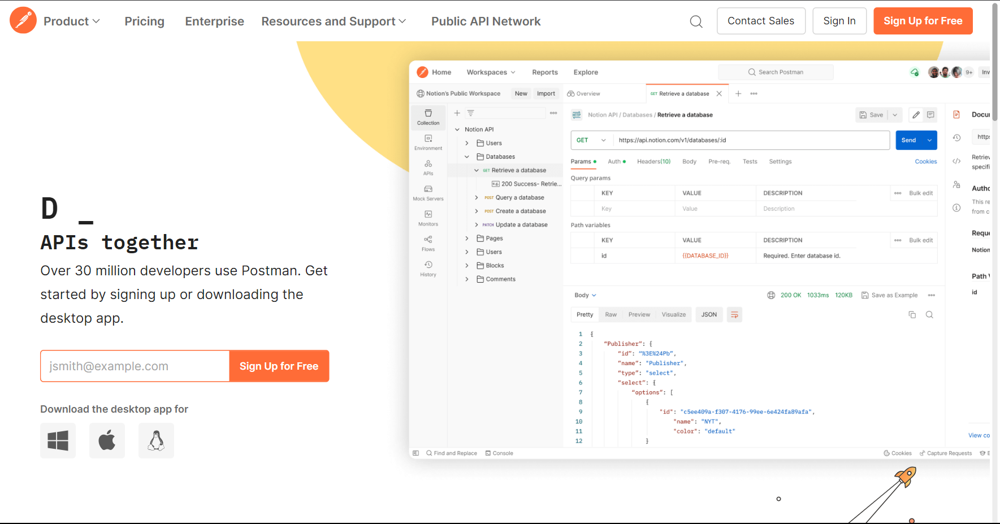
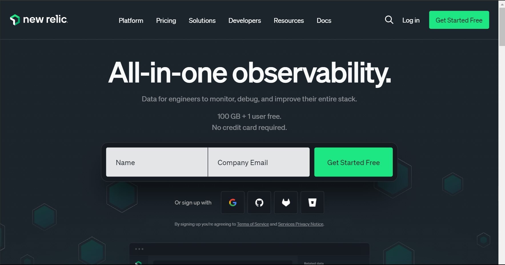
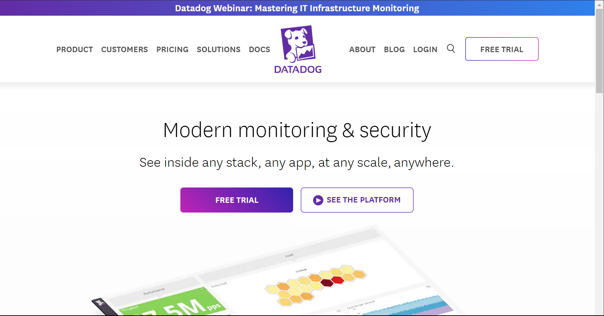
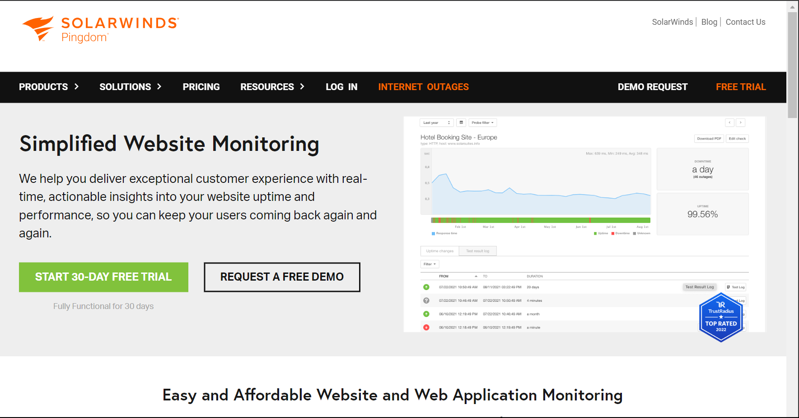

APIs are like the invisible helpers that keep all our digital services connected. They're behind every app we use, from getting the morning weather update to sending a message to a friend. But for everything to run smoothly, these APIs need to be reliable, just like we expect our favorite apps to work without a hitch every time we use them.

Imagine if an API suddenly stops working or gets slow. It's like a key part of a machine breaking down, and suddenly, things we take for granted, like sending an email or checking the news, start to fail or slow down. This can be really frustrating and, for businesses, it can even mean losing customers.

This is where the role of [API monitoring](https://apitoolkit.io/blog/error-monitoring-for-devops/) comes in. It's all about keeping a close watch on these APIs to make sure they're always up and running, just like a security guard keeping watch to ensure everything is safe and sound. Monitoring helps spot any issues early on, so they can be fixed before they turn into bigger problems, ensuring that our digital experiences remain seamless and uninterrupted. In this blog post, we'll explore the basic requirements of API monitoring, detailing what it takes to ensure your APIs remain reliable and effective in powering your digital services.

## Understanding API Monitoring

[API Monitoring](https://apitoolkit.io/blog/treblle-alternative/) is the systematic process of observing and analyzing the performance and availability of Application Programming Interfaces (APIs) to ensure they function correctly, efficiently, and continue to meet both user expectations and service level agreements. It involves tracking various metrics such as response times, error rates, traffic volumes, and more, to maintain optimal operation and swiftly address any issues that arise.

For Developers, API monitoring is indispensable. It acts as a real-time diagnostic tool, offering immediate insights into how APIs behave under different conditions. This visibility is crucial for identifying bottlenecks, debugging issues, and enhancing API efficiency. By proactively spotting and resolving problems, developers can reduce downtime and improve the user experience. Moreover, API monitoring aids developers in optimizing their code, leading to more robust and scalable API solutions. It also facilitates a data-driven approach to development, where decisions are made based on actual performance metrics rather than assumptions.

For [Businesses](https://apitoolkit.io/blog/error-monitoring-for-startups/), the significance of API monitoring extends well beyond technical benefits; it directly impacts customer satisfaction and the bottom line. In the digital marketplace, where user expectations for speed and reliability are higher than ever, the performance of APIs can make or break a service. API monitoring ensures that services remain seamless and responsive, thereby retaining users and maintaining competitive edge. Additionally, it helps [businesses](https://apitoolkit.io/blog/50-ap-tools-for-every-budget-and-requirement/) to scale efficiently by providing insights into usage patterns and potential stress points, enabling informed decisions about infrastructure and resource allocation. Ultimately, robust API monitoring supports business continuity, fosters trust among users, and drives growth by ensuring that digital services remain consistently reliable and high-performing.

API monitoring extends its benefits beyond developers and businesses, touching several other key groups within the digital ecosystem:

1. **Operations Teams:** For those responsible for the day-to-day operations of digital services, API monitoring is a lifeline. It enables them to ensure that the infrastructure supporting APIs remains robust and responsive. By preemptively identifying issues that could lead to service disruptions, operations teams can maintain service continuity and minimize downtime, which is critical for user satisfaction and operational efficiency.

2. **Quality Assurance (QA) Professionals:** QA teams rely on API monitoring to validate that APIs meet quality standards and function as intended across various environments. Continuous [monitoring](https://apitoolkit.io/blog/rum-vs-synthetic-monitoring/) allows for the early detection of anomalies and performance issues, facilitating a proactive approach to quality assurance and helping maintain high standards of software reliability and user experience.

3. **Product Managers:** Product managers benefit from API monitoring by gaining insights into how features are used and how well they perform. This data is invaluable for guiding product development, prioritizing feature enhancements, and making informed decisions that align with user needs and business goals.

4. **Customer Support Teams:** API monitoring can equip customer support teams with real-time data on system performance, enabling them to address customer queries more effectively and provide timely updates on issues affecting the service. This transparency can significantly enhance customer trust and satisfaction.

5. **Security Teams:** For security professionals, API monitoring is a crucial component of a comprehensive security strategy. It helps in identifying unusual patterns or spikes in traffic that could indicate a security threat, such as a DDoS attack or a breach attempt, allowing for swift action to mitigate potential risks.

6. **Third-party Developers and Partners:** When APIs are exposed to third-party developers and partners, monitoring becomes essential for managing external integrations. It ensures that third-party services relying on your APIs receive consistent, reliable data access, fostering healthy ecosystem relationships.

7. **Regulatory Compliance Officers:** In industries where compliance with legal and regulatory standards is mandatory, [API monitoring](https://apitoolkit.io/blog/rum-vs-synthetic-monitoring/) can provide audit trails and performance records necessary for demonstrating compliance with requirements around data handling, privacy, and service levels.

Generally, API monitoring serves as a critical tool across various roles within an organization, supporting operational stability, quality assurance, product development, customer satisfaction, security, ecosystem partnerships, and regulatory compliance. Its broad impact highlights the importance of implementing a robust API [monitoring](https://apitoolkit.io/blog/rum-vs-synthetic-monitoring/) strategy to support the diverse needs of all stakeholders involved in delivering and maintaining high-quality digital services.

## Key API Monitoring Metrics

When it comes to keeping your API in prime condition, there are a few vital signs you've got to keep an eye on, much like a doctor monitoring a patient's heartbeat and blood pressure. These metrics give you the lowdown on how well your API is performing and where it might need a bit of a tune-up.

1. **Response Time:** Response time measures how quickly your API can answer a request. Fast response times keep users happy by ensuring that your application feels snappy and responsive. To improve response time, focus on optimizing your code, database queries, and server configurations.

2. **Error Rates:** Error rates indicate the frequency of failed API requests. A high error rate can signal problems in your API's code or infrastructure that need immediate attention. Regularly tracking and analyzing these errors helps in identifying and rectifying issues promptly to maintain a reliable API.

3. **Traffic Volume:** Traffic volume reflects the number of requests your API receives over a given period. Monitoring this helps you understand your API's demand and peak usage times, enabling you to scale resources accordingly to handle load efficiently and prevent downtime.

4. **Latency:** Latency measures the time it takes for data to travel from the client to the server and back. Low latency is crucial for a seamless user experience, especially for time-sensitive applications. Optimizing network performance and server response can significantly reduce latency.

5. **Uptime:** This one's straightforward – it's all about availability. Is your API ready to go when called upon, or is it taking an unexpected nap? Consistent uptime is crucial; after all, an unavailable API is as good as a closed store.

## Choosing the Right API Monitoring Tools

Selecting the right tools for [API monitoring](https://apitoolkit.io/blog/treblle-alternative/) is like gearing up for a major league game. You want the best equipment in your corner to ensure you're not just playing, but also winning. With the right set of tools, you can keep a close eye on those key metrics we talked about, from response times to error rates. Here's a rundown of some top tools that can help you stay on top of your API's game:

1. **[APIToolkit](https://apitoolkit.io/):** APIToolkit stands out in the API monitoring field by offering comprehensive oversight. This tool goes beyond mere monitoring; it acts as both a guide and a strategist for your API, tracking its performance, detecting errors as they occur, and shedding light on usage patterns. Its strength lies in providing actionable insights that help you understand the root causes of issues and how to prevent them, ensuring your API operates smoothly.

2. **Postman:** Widely recognized for API testing, Postman also excels in monitoring capabilities. It allows for the setup of automated tests that periodically assess your API's performance and reliability, akin to a regular fitness regimen that keeps your API in optimal condition.

3. **New Relic:** New Relic offers a comprehensive overview of your digital environment, extending its monitoring capabilities beyond APIs to include the performance of entire applications. This holistic approach is crucial for diagnosing and fine-tuning system operations, making it invaluable for overall optimization.

4. **Datadog:** Datadog serves as a versatile monitoring tool, akin to a multifunctional device. It not only tracks API performance but also oversees servers, databases, and more, making it ideal for those seeking an all-encompassing monitoring solution that integrates various infrastructure components with API performance [metrics](https://apitoolkit.io/blog/embedded-apis-and-metrics/).

5. **Pingdom:** Pingdom prioritizes simplicity and user-friendliness in its monitoring solutions, specializing in tracking uptime and response times. It functions as a dependable guardian for your API, ensuring it remains operational and responsive at all times.

## Best Practices for API Monitoring

Keeping your [API monitoring](https://apitoolkit.io/blog/top-7-better-stack-alternative-for-api-monitoring-and-observability./) on point is all about being smart and strategic. Here are some winning moves to ensure your monitoring efforts are not just effective but also efficient:

1. **Set Clear Goals:** Know what you're monitoring and why. Are you keeping an eye on uptime, gunning for lightning-fast response times, or making sure errors are as rare as a blue moon? Setting clear objectives helps you focus on the [metrics](https://apitoolkit.io/blog/embedded-apis-and-metrics/) that matter most to your business.

2. **Automate the Routine:** Let machines handle the grunt work. Automate your monitoring processes wherever possible. This frees up your team to focus on analyzing the data and making informed decisions, rather than getting bogged down in manual checks.

3. **Stay Alert:** Set up smart alerts that notify you when things aren't going as planned. But be wary of alert overload; fine-tune them so you're informed, not inundated. It's about getting a nudge when necessary, not a constant barrage of pings.

4. **Drill Down into Data:** When your monitoring tools flag an issue, don't just skim the surface. Dive deep to understand the root cause. This might mean looking at logs, tracing transactions, or even revisiting code. The goal is to not just fix the issue but to learn from it and prevent a repeat performance.

5. **Keep Your Tools in Check:** Regularly review and update your monitoring tools and configurations. As your API evolves, so should your monitoring setup. It's like tuning a race car; you want it in peak condition to handle the demands of the race.

6. **Share Insights Across Teams:** Make your monitoring data accessible to different teams. Developers, operations, and even customer support can benefit from these insights. It fosters collaboration and ensures everyone is aligned in keeping the API—and by extension, the user experience—top-notch.

7. **Learn and Adapt:** Lastly, see each hiccup as a learning opportunity. Use your monitoring data to identify trends, anticipate potential issues, and continuously improve your API's performance and reliability.

## Troubleshooting Common API Issues

When your API starts acting up, it's time to don your detective hat and get to the bottom of things. Here are some savvy tips to troubleshoot and fix those pesky API issues:

1. **Check the Basics First:** Before you dive deep, make sure the fundamentals are solid. Is the API endpoint correct? Are the request headers properly set up? Sometimes, the culprit is as simple as a typo or a missing header.

2. **Use Logs Wisely:** Dive into your API logs with a purpose. Look for patterns or anomalies around the time the issue was reported. Logs are like breadcrumbs leading you back to the source of the problem.

3. **Replicate the Issue:** Try to replicate the problem in a controlled environment. Whether it's a staging setup or your local machine, seeing the issue first-hand can provide invaluable clues.

4. **Break It Down:** If the issue is complex, break it down into smaller parts. Test individual components of your API request and response flow. It's like solving a puzzle one piece at a time.

5. **Monitor the Metrics:** Revisit those key [API metrics](https://apitoolkit.io/blog/embedded-apis-and-metrics/) like response time and error rates. A spike or an unusual trend can often point you in the right direction.

6. **Check External Dependencies:** If your API relies on external services or databases, make sure they're all up and running smoothly. Sometimes the issue lies not within your API but with an external dependency.

7. **Consult the Community:** Don't underestimate the power of community wisdom. Forums, Stack Overflow, and even the API documentation itself can offer solutions or workarounds you might not have considered.

8. **Test, Test, Test:** Once you think you've fixed the issue, test rigorously to ensure the solution holds up under various scenarios. It's better to catch any oversights now than to have them resurface later.

9. **Document Your Findings:** Keep a record of the issue and how you resolved it. This not only helps in case the issue pops up again but also aids your team in learning from past challenges.

## Conclusion

In summary, [API monitoring](https://apitoolkit.io/blog/top-7-better-stack-alternative-for-api-monitoring-and-observability./) is crucial for maintaining the dependability and peak performance of Application Programming Interfaces, which are key to the smooth functioning of digital services and apps. It goes beyond being just a technical routine, emerging as a strategic tool that influences many aspects of an organization. API monitoring also helps build and maintain partnerships by ensuring reliable and consistent API performance for external collaborators.

All in all, [API monitoring](https://apitoolkit.io/blog/top-7-better-stack-alternative-for-api-monitoring-and-observability./) does not just preventing service disruptions; it actively creates a digital environment that's conducive to growth, innovation, and exceptional user experiences. API monitoring is an essential practice for any organization looking to deliver outstanding, trustworthy, and high-performing digital services.

## Keep Reading

[APIToolkit: Best Moesif Alternative for API Monitoring and Observability](https://apitoolkit.io/blog/moesif-alternative-for-monitoring-and-observability/)
[Error Monitoring for Startups: Why it's Essential for Early-stage Companies](https://apitoolkit.io/blog/error-monitoring-for-startups/)
[Top 7 Better Stack Alternatives for Api Monitoring and Observability](https://apitoolkit.io/blog/top-7-better-stack-alternative-for-api-monitoring-and-observability./)
[50 APi tools for Every Budget and Requirement](https://apitoolkit.io/blog/50-ap-tools-for-every-budget-and-requirement/)
[A Guide to Embedded API Logs and Metrics](https://apitoolkit.io/blog/embedded-apis-and-metrics/)